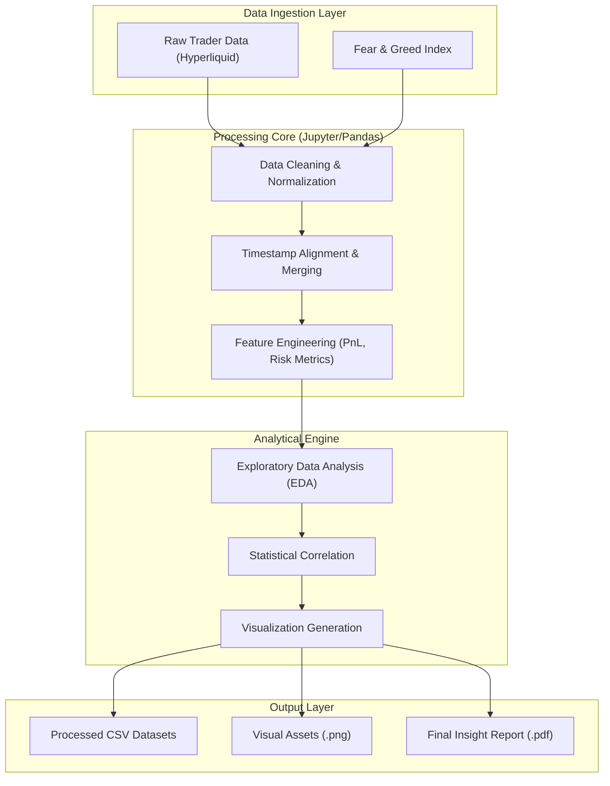

# Crypto Sentiment & Trader Behavior Analysis


> **Decoding the correlation between Bitcoin market sentiment and trader profitability through advanced data analytics.**

---


## 📑 Table of Contents
- [Overview](#-overview)
- [Key Features](#-key-features)
- [Architecture & Design](#-architecture--design)
- [Project Structure](#-project-structure)
- [Getting Started](#-getting-started)
- [Usage](#-usage)
- [Roadmap](#-roadmap)
- [Contributing](#-contributing)
- [License](#-license)

---

## 🔭 Overview

### The Problem
The cryptocurrency market is driven heavily by sentiment. While the **Fear & Greed Index** provides a macro view of market emotion, there is a lack of granular analysis on how individual trader behaviors—specifically regarding **leverage**, **side selection (Long/Short)**, and **volume**—correlate with these sentiment shifts. Do traders profit more when following the herd, or by acting as contrarians?

### The Solution
This project implements a robust data science pipeline that merges **Hyperliquid historical execution data** with **Bitcoin Fear & Greed Index** time-series data. By aligning these datasets, the system performs statistical analysis and exploratory data analysis (EDA) to uncover profitability patterns, risk exposure profiles, and behavioral divergences during extreme market conditions.

---

## ✨ Key Features

*   **📈 Sentiment-Time Alignment**: Advanced preprocessing algorithms to synchronize high-frequency trading data with daily/hourly sentiment indices.
*   **💰 Profitability Profiling**: Analysis of PnL (Profit and Loss) distribution across different sentiment zones (Extreme Fear vs. Extreme Greed).
*   **⚖️ Leverage Risk Assessment**: Statistical evaluation of leverage usage patterns and their correlation with liquidation risks.
*   **📊 Automated Visualization**: Generation of publication-ready charts (Stacked Bar, Time-series, Boxplots, Error Bars).
*   **📄 PDF Report Generation**: Automatic compilation of insights, statistics, and charts into a professional `ds_report.pdf`.

---

## 🏗 Architecture & Design

The system follows a linear **ETL (Extract, Transform, Load) & Analysis** pipeline architecture. It ingests raw CSV data, processes it through a Pandas-based engine, and outputs both structured data and visual intelligence.



### 🛠 Tech Stack

| Component | Technology | Description |
| :--- | :--- | :--- |
| **Language** | Python 3.x | Core logic and scripting. |
| **Environment** | Jupyter / Google Colab | Interactive development and execution environment. |
| **Data Manipulation** | Pandas, NumPy | High-performance data structures and analysis tools. |
| **Visualization** | Matplotlib, Seaborn | Static and statistical data visualization. |
| **Reporting** | FPDF / ReportLab | Programmatic PDF report generation. |

---

## 📂 Project Structure

```bash
ds_RahulRathnavel/
├── csv_files/                  # 💾 Data Storage
│   ├── fear_greed.csv          # Sentiment index source data
│   └── processed_data.csv      # Cleaned and merged datasets
├── outputs/                    # 📊 Visualization Artifacts
│   ├── chart_buy_sell_stacked.png
│   ├── chart_fg_vs_volume_timeseries.png
│   ├── chart_leverage_boxplot.png
│   └── chart_pnl_errorbar.png
├── notebook_1.ipynb            # 🧠 Core Analysis Logic (Entry Point)
├── ds_report.pdf               # 📄 Final Executive Summary
└── README.md                   # 📘 Documentation
```

---

## 🚀 Getting Started

### Prerequisites
*   **Python 3.8+**
*   **Jupyter Notebook** or access to **Google Colab**.
*   Basic understanding of financial time-series data.

### Installation

1.  **Clone the Repository**
    ```bash
    git clone https://github.com/rahulratho15/ds_RahulRathnavel_k.git
    cd ds_RahulRathnavel_k
    ```

2.  **Install Dependencies**
    If running locally, ensure you have the required libraries:
    ```bash
    pip install pandas numpy matplotlib seaborn fpdf
    ```

3.  **Data Setup**
    *   Ensure `csv_files/` contains the raw datasets.
    *   If using Google Colab, you may need to mount your Google Drive or upload files to the session storage.

---

## 💻 Usage

The entire analysis is encapsulated within `notebook_1.ipynb`.

1.  **Launch the Notebook**:
    ```bash
    jupyter notebook notebook_1.ipynb
    ```
    *Or open the file in Google Colab.*

2.  **Run the Pipeline**:
    Execute the cells sequentially. The notebook is structured to:
    1.  **Load Data**: Import CSVs from the `csv_files` directory.
    2.  **Process**: Clean null values and merge datasets on timestamps.
    3.  **Analyze**: Calculate correlations between Sentiment and PnL.
    4.  **Export**:
        *   Save charts to `outputs/`.
        *   Save processed data to `csv_files/`.
        *   Generate `ds_report.pdf`.

3.  **View Results**:
    Check the `outputs/` folder for visual insights or open `ds_report.pdf` for the summarized findings.

---

## 🔮 Roadmap / Future Enhancements

- [ ] **Machine Learning Integration**: Train a Random Forest or LSTM model to predict trader profitability based on current sentiment.
- [ ] **Real-Time Dashboard**: Migrate the static analysis to a dynamic Streamlit or Dash web application.
- [ ] **Multi-Exchange Support**: Expand the dataset to include Binance and Bybit execution data.
- [ ] **Sentiment NLP**: Integrate Twitter/X API to generate a custom sentiment index using NLP instead of relying on third-party indices.

---

## 🤝 Contributing

Contributions are welcome! Please follow these steps:

1.  Fork the project.
2.  Create your feature branch (`git checkout -b feature/AmazingFeature`).
3.  Commit your changes (`git commit -m 'Add some AmazingFeature'`).
4.  Push to the branch (`git push origin feature/AmazingFeature`).
5.  Open a Pull Request.

---

## 📄 License & Acknowledgements

*   **Author**: Rahul Rathnavel
*   **License**: Distributed under the MIT License.
*   **Data Sources**: Hyperliquid (Trading Data), Alternative.me (Fear & Greed Index).
